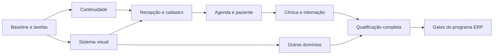

# Roadmap frontend — da continuidade à assinatura CVG Pulse

**Sequência recomendada:** estabilizar a navegação, estabelecer o sistema visual, redesenhar uma jornada completa, expandir por domínio e certificar o candidato. O [plano executivo](2026-09-06-plano-executivo-frontend-premium.md) define a experiência; o [backlog](2026-09-06-backlog-frontend-premium.md) contém os tickets `FEA-*`. A [auditoria](2026-09-06-auditoria-frontend-usabilidade-estetica.md) é a baseline de descoberta, não certificado do candidato futuro.

## 1. Calendário relativo e capacidade

**T0** é a data em que capacidade, ambiente e responsáveis estão disponíveis. As semanas abaixo são janelas de planejamento, sem compromisso de calendário. Premissa: 2 FE, 1 QA, 0,5 UX; 25% de reserva. A disponibilidade de 1 FE no plano ERP não sustenta automaticamente este cenário. Reestimar ao fechar F0; com uma única pessoa FE, executar ondas sequenciais e negociar escopo antes de divulgar prazo.

| Onda | Janela indicativa | Resultado demonstrável | Tickets principais | Gate de saída |
| --- | --- | --- | --- | --- |
| F0 — enquadramento | S1 | Snapshot reproduzível, tarefas e métricas baseline | FEA-001–003 | G0: inventário, responsáveis, dados e dispositivos identificados |
| F1 — continuidade | S2–S3 | Navegação sem reload, formulário protegido e listas estáveis | FEA-004–008 | G1: ida/volta, concorrência e recuperação comprovadas |
| F2 — assinatura visual | S2–S4 | Tokens, botões, formulários, feedback e movimento aplicados a uma superfície | FEA-009–016 | G2: estados completos, contraste e revisão visual independente |
| F3 — jornada prioritária | S4–S7 | Recepção → tutor/paciente → Agenda, incluindo mobile | FEA-017–022 | G3: jornada completa com dados controlados e ganho de tarefa |
| F4 — continuidade clínica | S7–S9 | Prontuário, internação e leitos coerentes com o sistema | FEA-023–024 | G4: operação clínica revisada, contexto e estados preservados |
| F5 — expansão do frontend | S8–S11 | Financeiro, estoque, laboratório, relatórios e administração | FEA-025–029 | G5: cada domínio demonstra estados reais e escopo aprovado |
| F6 — qualificação | S11–S13 | Candidato acessível, mensurado e revisado por usuários | FEA-030–034 | G6: dossiê fresco, UAT e regressões; alimentar gates ERP |

A janela de 13 semanas é hipótese de capacidade e paralelismo, não soma das estimativas. O backlog dimensiona esforço principal; QA e UX têm filas próprias. Replanejar se o somatório detalhado superar capacidade útil, se integrações estiverem indisponíveis ou se a revisão de domínio ampliar escopo. Não comprimir homologação para compensar atraso de implementação.

## 2. Caminho crítico e sobreposições permitidas

F1 e F2 podem ocorrer simultaneamente após baseline: contratos de navegação e tokens têm fronteiras separáveis. A revisão dos módulos restantes começa cedo, mas a implantação do novo padrão aguarda G2. F5 pode se sobrepor a F4 apenas com capacidade independente e sem disputar arquivos centrais. Performance e acessibilidade começam na fundação e são verificadas em cada onda; F6 consolida, não descobre pela primeira vez.

Dependências externas: `AAA-001` identifica baseline global; `AAA-002` condiciona testes com serviços reais; escopo e decisões do release seguem `AAA-003`. `AAA-007` recebe as extrações de páginas; `AAA-044` recebe UAT/visual/a11y; `AAA-045` recebe regressão do candidato. A conclusão de uma onda não altera automaticamente esses estados.

## 3. Demonstrações e provas por marco

### G0 — sabemos o que estamos mudando

Reproduzir os três problemas de continuidade no estado atual. Registrar rotas, funções, permissões, volumes e estados disponíveis. Medir cinco tarefas, com a mesma definição usada depois: localizar tutor; cadastrar dados essenciais; localizar/remarcar compromisso; abrir paciente e retornar à fila; registrar informação e confirmar salvamento. Definir participantes, dispositivos e tempo de observação com Operação.

**Não avançar a fechamento de achados** se o comportamento já tiver mudado: reclassificar como corrigido por outra entrega, não reproduzido ou confirmado, com evidência. É possível avançar a arte conceitual enquanto isso.

### G1 — o trabalho não se perde

Executar link interno, voltar/avançar, filtros e formulário alterado. Forçar respostas fora de ordem, erro e desmontagem. Confirmar que somente a consulta atual altera o estado. O carregamento não pode apagar dados válidos ou sinalizar conclusão antecipada. Demonstrar recuperação de formulário conforme política aprovada, sem prometer persistência inexistente.

### G2 — a assinatura existe em componentes reais

Renderizar uma página preenchida, não apenas uma prancha de cores. Inspecionar todos os estados dos botões e campos em ambos os temas. Navegar só com teclado. Validar preferência de movimento reduzido e origem/destino do foco. Revisar imagem e vídeo no recorte final, mantendo texto e marca em camada própria. O estudo em `docs/frontend` é insumo; não satisfaz este gate de implementação.

### G3 — o balcão ficou mais simples

Comparar a mesma tarefa e massa de dados da baseline. Na Recepção, busca e próximo item visíveis; no cadastro, informações essenciais primeiro; na Agenda, dia relevante acessível sem percorrer a página. A alternativa mobile deve permitir a tarefa completa, inclusive quando não houver gesto de arrastar. Provar erros, vazio, lentidão e permissão insuficiente.

### G4/G5 — o padrão sobrevive à complexidade

Usar nomes longos, prontuário extenso, leitos cheios, pagamento pendente, tabelas largas e filtros combinados. Manter contexto clínico, unidade, moeda, datas e ações de risco explícitos. Cada domínio precisa de aceite próprio: um dashboard bonito não prova qualidade do caixa ou do prontuário.

### G6 — temos evidência para decidir

Executar matriz cross-browser e de dispositivos pactuada; ambos os temas; teclado, leitor de tela, zoom e movimento reduzido. Consolidar métricas de laboratório e, quando houver volume, de campo. Registrar amostra de UAT, taxa de conclusão, erros e tempos. Revisor independente inspeciona o candidato exato. O resultado é uma recomendação frontend; o GO do ERP segue os gates globais e os responsáveis do programa.

## 4. Cadência e controle de escopo

Toda semana termina com uma jornada demonstrada, registro dos defeitos e um artefato comparável à baseline. Toda mudança visual tem captura antes/depois e decisão de revisão. O backlog é atualizado no mesmo momento da evidência; documento escrito, captura criada ou teste iniciado não significa DONE.

Entrega pode avançar em ambiente de revisão por rota, com reversão definida. Antes de promover: versão anterior disponível, nenhuma alteração de contrato implícita, tratamento de rascunhos descrito e monitoramento de erro do frontend. Não publicar assets pesados apenas porque a geração terminou.

Se a capacidade cair, preservar F0, F1 e a fatia F3 com o subconjunto necessário de F2. Adiar a expansão de módulos e vídeos adicionais, mantendo os critérios de segurança operacional e acessibilidade. Se a descoberta encontrar falha clínica/financeira crítica, criar bloqueador explícito e elevar ao programa ERP.

## 5. Primeiros dez dias úteis propostos

| Período | Trabalho | Saída verificável |
| --- | --- | --- |
| Dias 1–2 | Snapshot, inventário, contratos, tarefas e ambiente | FEA-001/002 em revisão, achados reproduzidos |
| Dias 3–4 | Baseline de desempenho/uso; corrigir navegação e concorrência em fatias isoladas | Registros antes/depois; sem fechamento prematuro |
| Dias 5–6 | Política de formulário, foco/retorno e primeiros tokens | Contratos e demonstração funcional |
| Dias 7–8 | Botões, feedback e composição da Recepção | Página preenchida nos dois temas e mobile |
| Dias 9–10 | Revisão independente da fatia, correções e reestimativa | Decisão G1/G2 parcial com lacunas explícitas |

Esses dez dias são roteiro de início, não promessa de terminar todos os tickets citados. O status inicial detalhado permanece no backlog.
